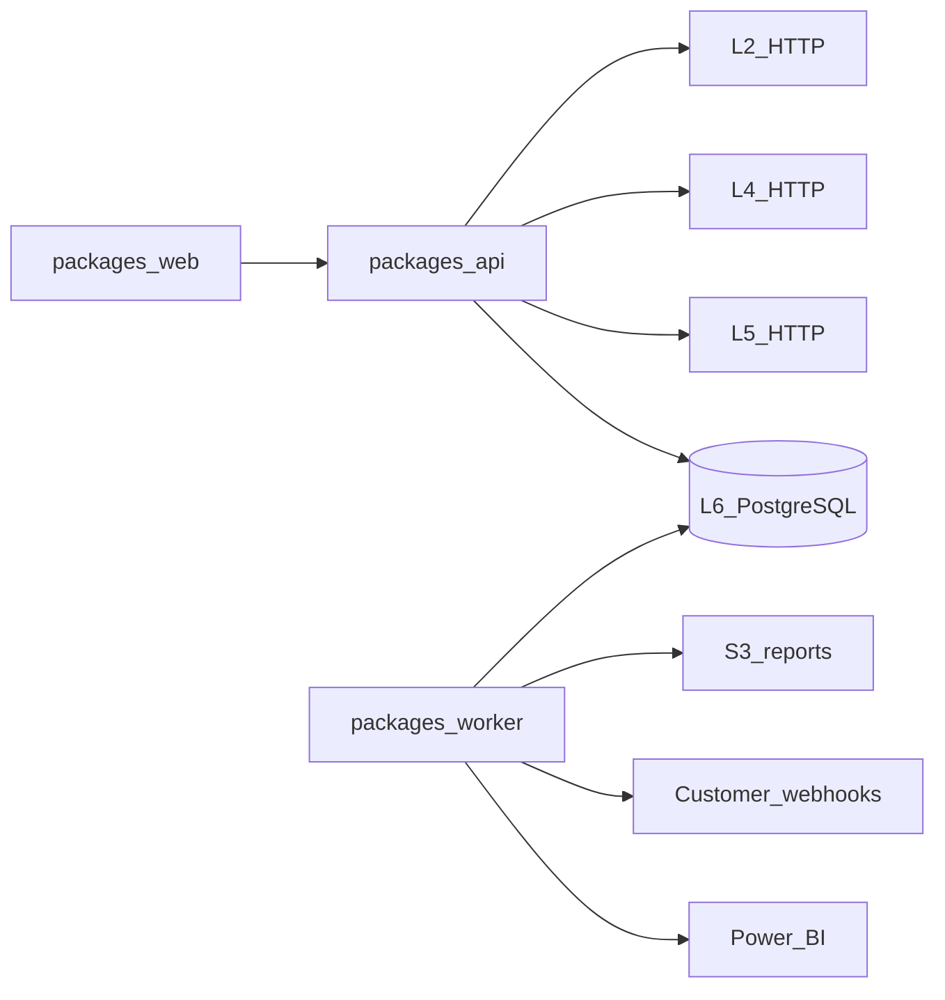

# Implementation Plan: Complete Stamped L6

## Summary

Complete L6 as a pnpm TypeScript modular monolith: Next.js web, Fastify BFF,
shared contracts, PostgreSQL/Drizzle, and a pg-boss worker. Preserve L2/L4/L5
HTTP boundaries, deliver the full Forge desktop/mobile experience, and finish
reports plus enterprise integrations without Redis.

The detailed commit and validation contract is
[`IMPLEMENTATION_PLAN.md`](../../../IMPLEMENTATION_PLAN.md).

## Constitution check

- Platform authority stays under `external/`; no shared contract fork.
- Browser calls only L6 BFF.
- Claim vocabulary is distinct and missing data remains explicit.
- Tenancy/RBAC fails closed with negative tests.
- Mobile, keyboard, route states, and WCAG AA are release gates.
- Each commit is independently testable and each phase produces a report.

**Result:** Pass.

## Technical context

- Node.js 22+, pnpm 11, TypeScript strict mode.
- Next.js App Router with Server Components and focused client islands.
- Fastify with schema validation, RFC 9457 errors, request IDs, structured logs.
- Better Auth local accounts plus Microsoft Entra OIDC.
- PostgreSQL with Drizzle migrations; pg-boss for background work.
- Durable L5 event log plus PostgreSQL `LISTEN/NOTIFY` and browser SSE.
- Tailwind/shadcn adapted to Forge Industrial; ECharts 6 for dense charts.
- Playwright for browser tests and PDF; streaming XLSX writer.
- AWS CDK TypeScript targeting `ap-south-1`.

## Architecture



## Repository structure

```text
packages/
  web/            Next.js routes, feature UI, client queries
  api/            auth, tenancy, BFF services, SSE, public API
  contracts/      L6 schemas, mappings, generated clients
  worker/         reports, schedules, webhooks, Power BI
contracts/upstream/
tests/e2e/
infra/
docs/integration/
```

## Data model

L6-owned entities:

- User/session/account/verification and MFA state managed by Better Auth.
- Organization, plant, membership, role, and permission assignment.
- User preference including active plant and pinned reveal modules.
- Append-only audit event.
- Durable upstream event with upstream cursor and dedupe identity.
- Report request/artifact/approval.
- Webhook endpoint/subscription/delivery and secret reference.
- API key hash/scope/expiry.
- SSO provider metadata and secret reference.
- Power BI connection/checkpoint and secret reference.

L6 does not persist telemetry, baselines, findings, prescriptions, workflow
state, or ledger truth.

## API boundaries

- Session BFF under `/app/v1`: plants, Today, alarms, prescriptions, evidence,
  ledger, analytics, analyst, reports, preferences, admin, and SSE.
- Public API under `/v1`: documented plants, prescriptions, ledger,
  timeseries, intensity, reports, event poll, and OpenAPI.
- Auth under `/api/auth/*`.
- Writes require explicit permission and an idempotency key.
- All list endpoints are bounded and cursor-paginated.

## Delivery phases

1. Authority/specification and upstream prompts.
2. pnpm, CI, contracts, Fastify, PostgreSQL, worker, local compose.
3. Local auth, tenancy, RBAC, admin, plant preferences.
4. Forge shell, complete route states, responsive/accessibility foundations.
5. L2/L4/L5 adapters and PostgreSQL-backed resumable SSE.
6. Operational Today/alarms/prescriptions/evidence/ledger/CSV.
7. Analytics and both analyst modes.
8. Report jobs, PDF/XLSX, sustainability, Export Centre.
9. Public API/webhooks, Entra, Power BI, telemetry, AWS CDK.
10. E2E, security, performance, accessibility, validation, cutover.

## Test strategy

- Pure unit tests use Node's test runner.
- Fastify inject and HTTP mock servers test API boundaries.
- PostgreSQL integration tests cover migrations, pg-boss, tenancy, and events.
- Playwright covers role journeys at desktop and 360px mobile.
- Axe/manual checks cover accessibility; visual snapshots cover routes/PDF.
- Schemathesis covers public OpenAPI; Standard Webhooks libraries verify
  signatures and replay behavior.
- CDK assertions and cdk-nag cover infrastructure.

## Performance strategy

- Minimize client boundaries; stream slow independent route sections.
- Dynamically load ECharts only for chart routes.
- Cap telemetry resolution by range and use min-max/LTTB/progressive rendering.
- Instrument LCP, INP, and CLS without PII.
- Keep Chromium and file generation out of request processes.

## Security strategy

- Verified invitations, no self-signup, rate-limited auth, secure cookies,
  CSRF/origin controls, optional TOTP, session revocation.
- Service-layer authorization on every protected operation.
- Hashed API keys, secret references, log redaction, HTTPS-only SSRF-safe
  webhook validation, expiring report URLs.
- Typed analyst context and explicit confirmation before any action.

## Rollout

Fixture-backed CI precedes staging adapters. Enable L5, then L2, then L4.
Deploy backward-compatible migrations and web/API/worker containers to AWS
Mumbai. Activate local auth first; then Entra; then public integrations.
Cutover requires three consecutive complete E2E passes and tested rollback.
