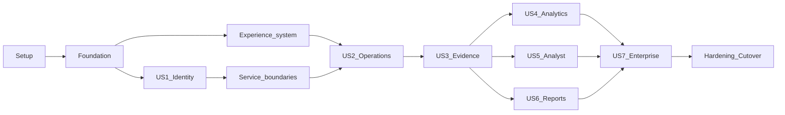

# Tasks: Complete Stamped L6

Every task includes tests in the same commit and follows the detailed commit
contract in `IMPLEMENTATION_PLAN.md`.

## Phase 1 — Setup

- [x] T001 Establish lived authority in `PROJECT_OVERVIEW.md`, `PROGRESS.md`, `DECISIONS.md`, and `IMPLEMENTATION_PLAN.md`
- [x] T002 Create and validate specification artifacts in `.specify/specs/l6-completion/`
- [x] T003 [P] Define product and Forge design context in `PRODUCT.md` and `DESIGN.md`
- [x] T004 [P] Publish sibling contract prompts in `docs/integration/UPSTREAM_AGENT_PROMPTS.md`

## Phase 2 — Foundational

- [ ] T005 Migrate root tooling to pnpm workspace in `package.json`, `pnpm-workspace.yaml`, and `pnpm-lock.yaml`
- [ ] T006 Add required CI jobs in `.github/workflows/ci.yml`
- [ ] T007 Create shared schemas and mapping tests in `packages/contracts/`
- [ ] T008 Pin upstream transport snapshots in `contracts/upstream/`
- [ ] T009 Scaffold Fastify BFF and tests in `packages/api/`
- [ ] T010 Add PostgreSQL/Drizzle schema and migrations in `packages/api/src/db/`
- [ ] T011 Scaffold pg-boss worker and tests in `packages/worker/`
- [ ] T012 Add local stack and safe env examples in `compose.yaml` and `.env.example`

## Phase 3 — US1 Identity, tenancy, and plant context

- [ ] T013 [US1] Integrate local Better Auth accounts in `packages/api/src/features/auth/`
- [ ] T014 [US1] Add invite, verification, reset, and captured mail flows in `packages/api/src/features/auth/`
- [ ] T015 [US1] Add optional TOTP and session controls in `packages/api/src/features/auth/`
- [ ] T016 [US1] Model organizations, plants, memberships, and roles in `packages/api/src/features/tenancy/`
- [ ] T017 [US1] Enforce the permission matrix in `packages/api/src/features/authz/`
- [ ] T018 [US1] Build user administration in `packages/web/src/app/settings/admin/`
- [ ] T019 [US1] Build persistent authorized plant switching in `packages/web/src/components/shell/`
- [ ] T020 [US1] Harden authentication boundaries in `packages/api/tests/security/`

## Phase 4 — Shared product experience

- [ ] T021 [P] Implement Forge tokens/fonts in `packages/web/src/styles/`
- [ ] T022 Add accessible UI primitives in `packages/web/src/components/ui/`
- [ ] T023 Build responsive role-aware shell in `packages/web/src/components/shell/`
- [ ] T024 Add reusable route states in `packages/web/src/components/states/`
- [ ] T025 Implement progressive navigation in `packages/web/src/components/shell/`
- [ ] T026 Establish accessible dense chart foundation in `packages/web/src/components/charts/`

## Phase 5 — Operational service boundaries

- [ ] T027 [P] Add resilient L5 client in `packages/api/src/upstream/l5/`
- [ ] T028 [P] Add bounded L2 client in `packages/api/src/upstream/l2/`
- [ ] T029 [P] Add L4 analyst client in `packages/api/src/upstream/l4/`
- [ ] T030 Add canonical workflow and claim mappings in `packages/contracts/src/mappings/`
- [ ] T031 Persist and ingest L5 event cursor in `packages/api/src/features/events/`
- [ ] T032 Expose resumable SSE in `packages/api/src/features/events/`

## Phase 6 — US2 Operational control room

- [ ] T033 [US2] Build decision-first Today in `packages/web/src/app/page.tsx`
- [ ] T034 [US2] Ship alarm list/detail/actions in `packages/web/src/app/alarms/`
- [ ] T035 [US2] Ship prescription queue/detail/actions in `packages/web/src/app/prescriptions/`
- [ ] T036 [US2] Certify operational desktop/mobile journeys in `tests/e2e/operations.spec.ts`

## Phase 7 — US3 Evidence and savings

- [ ] T037 [US3] Ship pre-scoped evidence explorer in `packages/web/src/app/evidence/`
- [ ] T038 [US3] Ship claim-safe ledger in `packages/web/src/app/reports/ledger/`
- [ ] T039 [US3] Add safe CSV exports in `packages/api/src/features/exports/`

## Phase 8 — US4 Analytics

- [ ] T040 [P] [US4] Add Energy module in `packages/web/src/app/energy/`
- [ ] T041 [P] [US4] Add Equipment module in `packages/web/src/app/equipment/`
- [ ] T042 [US4] Add TOD/MD module in `packages/web/src/app/energy/tod/`
- [ ] T043 [US4] Add intensity/emissions module in `packages/web/src/app/intensity/`

## Phase 9 — US5 Analyst

- [ ] T044 [US5] Complete contextual Mode A in `packages/web/src/components/analyst/`
- [ ] T045 [US5] Complete cited Mode B in `packages/web/src/app/analyst/`
- [ ] T046 [US5] Add human-confirmed action handoff in `packages/api/src/features/analyst/`

## Phase 10 — US6 Sustainability reports

- [ ] T047 [US6] Add report scheduling/lifecycle in `packages/worker/src/jobs/reports/`
- [ ] T048 [US6] Build print-safe report template in `packages/web/src/app/internal/reports/`
- [ ] T049 [US6] Generate PDF artifacts in `packages/worker/src/reports/pdf.ts`
- [ ] T050 [US6] Generate XLSX/activity data in `packages/worker/src/reports/xlsx.ts`
- [ ] T051 [US6] Add focused BRSR/PAT sections in `packages/worker/src/reports/sections/`
- [ ] T052 [US6] Complete Export Centre in `packages/web/src/app/reports/`

## Phase 11 — US7 Enterprise integration

- [ ] T053 [US7] Publish scoped `/v1` and OpenAPI in `packages/api/src/public/`
- [ ] T054 [US7] Add Standard Webhooks delivery in `packages/worker/src/jobs/webhooks/`
- [ ] T055 [US7] Build webhook delivery admin in `packages/web/src/app/settings/integrations/`
- [ ] T056 [US7] Add Entra organization sign-in in `packages/api/src/features/auth/entra.ts`
- [ ] T057 [US7] Add Power BI pilot connector in `packages/worker/src/jobs/powerbi/`
- [ ] T058 [US7] Instrument allowlisted product/web-vitals telemetry in `packages/web/src/instrumentation-client.ts`
- [ ] T059 [US7] Define AWS Mumbai deployment in `infra/`

## Final Phase — Hardening and cutover

- [ ] T060 Expand full role/integration E2E in `tests/e2e/`
- [ ] T061 Resolve independent security review findings in affected packages
- [ ] T062 Enforce web performance budgets in `packages/web/`
- [ ] T063 Complete WCAG AA/responsive hardening in `packages/web/`
- [ ] T064 Add complete orchestrator in `scripts/validate.sh`
- [ ] T065 Finalize runbooks in `docs/operations/`
- [ ] T066 Execute AWS pilot cutover checklist in `docs/operations/CUTOVER.md`

## Dependencies

Parallel markers are limited to disjoint files. Shared contracts, migrations,
workspace files, and root docs remain lead-owned.
