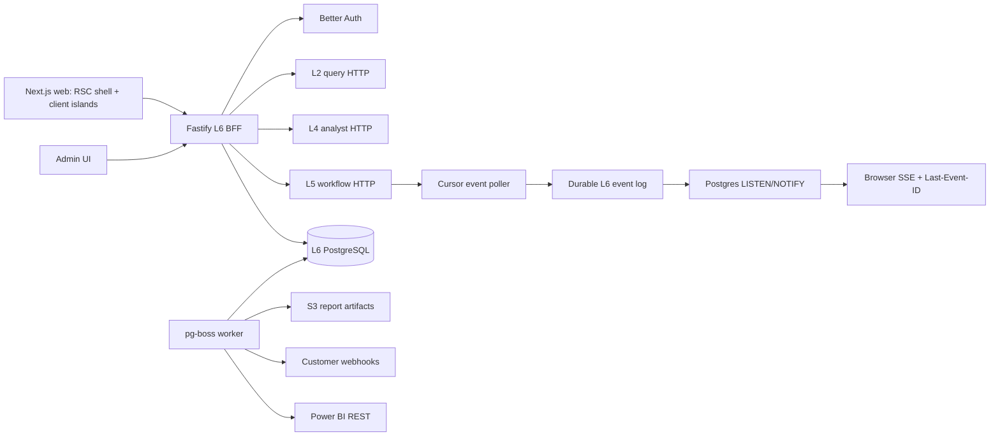
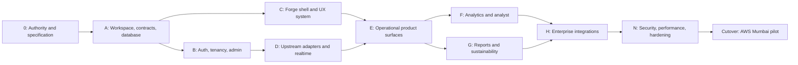

# Stamped L6 Experience & Integration — Master Execution Plan

## §0 Plan metadata

- **Mode:** Project, consumer greenfield completion.
- **Stack:** Node.js 22+, pnpm 11 workspace, Next.js App Router + React + TypeScript, Fastify BFF, Better Auth, PostgreSQL + Drizzle, pg-boss, Tailwind/shadcn adapted to Forge Industrial, Apache ECharts 6.1+, Playwright, AWS CDK.
- **Version rule:** Resolve latest stable compatible dependency versions during scaffold; commit one `pnpm-lock.yaml`; run audit and license checks before accepting each dependency.
- **Base branch:** `main`; implementation branch follows `cursor/<scope>-fa8d` policy.
- **Authority:** [L6 SSOT](/workspace/external/technical/layers/L6-experience-and-integration.md), [architecture handoff](/workspace/external/handoff/stamped-l6-architecture-handoff.md), [UI charter](/workspace/external/handoff/stamped-l6-ui-ux-charter.md), [ADR-020](/workspace/external/decisions/ADR-020-l5-mv-claim-governance.md), [ADR-022](/workspace/external/decisions/ADR-022-l6-bff-runtime-boundary.md), [ADR-023](/workspace/external/decisions/ADR-023-l6-ems-and-analyst-context.md), and [Forge Industrial](/workspace/external/design/forge-industrial-design-system.md).
- **Estimated commits:** 48–55 independently gated commits. This is one complete L6 program; P0/P1/P2 labels classify capabilities but do not create artificial delivery stops.
- **Lead:** Own integration, commits, documentation, quality gates, upstream prompts, PR, and cutover.

## §1 North star and scope boundary

### Objective

Ship a professional, production-capable L6 control room where all roles can switch plants, act on alarms and prescriptions, inspect defensible evidence and savings, use the analyst, create sustainability artifacts, administer access/integrations, and connect Power BI or another customer system without bypassing L2/L4/L5 boundaries.

### Deliverables

- A polished responsive product under `[packages/web](/workspace/packages/web)`, not a fixture-only seed.
- A separate tenant-scoped Fastify BFF under `packages/api`.
- Shared L6 schemas/generated clients under `packages/contracts`.
- PostgreSQL migrations for auth, tenancy, plants, preferences, audit, reports, integration configuration, and durable event replay.
- A pg-boss worker under `packages/worker` for reports, schedules, webhook retry/DLQ, and Power BI sync.
- Full route inventory from the UI charter: Today, alarms/detail, prescriptions/detail, evidence, analyst, reports/ledger, energy, equipment, TOD/MD, intensity/CO₂, settings, integrations, and admin.
- Better Auth local email/password authentication, admin invitations, verification/reset, optional TOTP MFA, session management, organizations, plant membership, RBAC, and no public registration.
- Microsoft Entra OIDC sign-in and organization mapping.
- Public `/v1`, OpenAPI 3.1, scoped API keys, event polling, Standard Webhooks-compatible outbound delivery, and Power BI reference integration.
- PDF and XLSX sustainability reports covering energy consumption, SEC, applicable Scope 1/2 emissions, renewable percentage, demand charges, power factor, savings achieved, and monthly energy KPIs; missing/non-measured values remain explicit.
- AWS Mumbai deployment definitions and operations docs.
- Root `PROJECT_OVERVIEW.md`, `IMPLEMENTATION_PLAN.md`, `DECISIONS.md`, `PROGRESS.md`, PRODUCT/DESIGN context, phase reports, runbooks, and a single `scripts/validate.sh`.
- `docs/integration/UPSTREAM_AGENT_PROMPTS.md` containing ready-to-paste L5 alarm-action and L2 ledger/baseline contract prompts.

### Priority bands

- **P0 operational core:** auth/RBAC, plant switcher, Today, alarms, prescriptions, evidence, ledger/CSV, SSE, claim safety, Mode A, mobile/desktop excellence.
- **P1 depth:** energy/equipment/TOD/intensity modules, live Mode B, PDF/XLSX sustainability reports, approval flow, PostgreSQL jobs.
- **P2 enterprise integration:** admin-managed Entra, public API, API keys, webhooks/DLQ/replay, Power BI, BRSR/PAT-focused exports, telemetry.
- These bands are traceability labels. Execution follows technical dependencies and continues through all bands.

### Non-goals

- WhatsApp magic links, Redis, direct L2 database access, OT/SCADA writes, automatic agent actions, bill-verified claims from ops data, native mobile, Hindi, multi-plant portfolio rollup, direct SAP/Tally writes, full BRSR filing, SCIM, and named ERP writes.

## §2 Prerequisites and blockers

- **L5 alarm writes:** Published L5 HTTP exposes list/silence but not all ack/escalate/clear actions required by ADR-023. Create an exact agent prompt and local mock contract first. Live alarm-action cutover remains blocked until L5 publishes and pins OpenAPI routes. L6 must never invent alarm truth.
- **L2 reads:** Customer-safe ledger and baseline reads must be promoted to the L2 query API. Create an agent prompt and fixture contract. Never use L2 admin or database access.
- **L4 live analyst:** Mode A can use a fixture adapter; Mode B live activation requires L4 session/message endpoints and context mapping. The rest of L6 must remain independent.
- **Email:** Local auth development uses a captured mail adapter; production verification/invitation/reset requires approved SES identity in `ap-south-1`.
- **Entra and Power BI:** Code and tests use fake adapters until tenant ID, app registration, workspace access, and secret-manager references are supplied. Credentials are a cutover checkpoint, not an implementation blocker.
- **AWS:** CDK synth/tests can complete without credentials. Deployment requires account/region/bootstrap approval.
- **External authority conflicts:** Record local decisions, then propose stamped-external updates rather than silently redefining platform semantics.

## §3 Authority and artifact map

- `external/**` is read-only platform authority. Shared schemas are consumed from the submodule, never copied into product packages.
- Root `IMPLEMENTATION_PLAN.md` becomes this approved execution contract.
- Root `PROJECT_OVERVIEW.md`, `PROGRESS.md`, and `DECISIONS.md` are writable lived-product documents.
- `PRODUCT.md` and `DESIGN.md` capture Impeccable product/design context while referencing Forge as authority.
- `contracts/upstream/*.openapi.json` contains pinned generated snapshots from live sibling implementations plus source commit metadata; these are transport snapshots, not replacements for `external/contracts`.
- `packages/contracts` owns only L6 internal schemas, upstream DTO mappings, public OpenAPI generation, and generated clients.
- `docs/integration/UPSTREAM_AGENT_PROMPTS.md` owns actionable prompts for sibling agents.
- `.specify/specs/l6-completion/` stores Spec Kit specification, clarification decisions, and tasks generated during Phase 0.

## §4 Architecture and system map




### Runtime decisions

- **Web:** Dynamic authenticated App Router shell. Server Components fetch initial route data through the BFF; TanStack Query owns live/refetching server state; local state owns drawers, filters, selections, and form drafts. URL state owns filterable/shareable views.
- **API:** Fastify handlers validate Zod schemas and call feature services. Authorization is enforced in the service layer after session and organization/plant resolution. External clients have explicit timeouts, structured errors, circuit state, bounded read retries, and no automatic write retry without an idempotency key.
- **Auth:** Better Auth on Fastify with email/password, organization, admin, and 2FA capabilities. Public signup is disabled. Admin invitations establish org/plant membership. Entra uses OIDC authorization code flow and maps verified organization identities to existing memberships; it does not bypass RBAC.
- **Database:** PostgreSQL is L6-owned. Drizzle migrations are versioned and reversible where possible. It stores L6 identity/authorization, preferences, audit, reports, integrations, durable event cursors, and delivery metadata, but never duplicates L2 ledger or L5 workflow truth.
- **Realtime without Redis:** One poller leader, protected by a PostgreSQL advisory lock, reads L5 events into an append-only event table. `LISTEN/NOTIFY` wakes API instances; SSE reads durable rows by event ID, enabling resume and multi-instance fan-out without Redis.
- **Jobs without Redis:** pg-boss uses PostgreSQL `SKIP LOCKED`, retries with capped exponential backoff, cron scheduling, retention, DLQ, and redrive. Every handler is idempotent despite queue delivery guarantees.
- **Reports:** Worker opens a signed internal report route with Playwright Chromium and print CSS, stores PDF/XLSX artifacts in S3, and exposes expiring download links. Reports require approval before external send.
- **Power BI:** A service-principal adapter provisions/synchronizes a bounded push semantic model for the pilot, batches at or below Microsoft limits, stores checkpoints, and exposes manual retry. Document that service-principal profiles are incompatible with push semantic models; use one approved workspace for acceptance.
- **AWS:** CDK in `infra/` provisions separate stateful and application stacks in `ap-south-1`: RDS PostgreSQL, ECS/Fargate web/API/worker, ALB, S3, SES integration, Secrets Manager references, CloudWatch, least-privilege IAM, backups, alarms, and termination protection for stateful resources. Run `cdk synth --strict`, `cdk-nag`, and `cdk diff` before deploy.

### Target layout

```text
experience-integration/
├── packages/
│   ├── web/              # Next.js product UI
│   ├── api/              # Fastify BFF + auth + public API
│   ├── contracts/        # L6 schemas, mappings, generated clients
│   └── worker/           # pg-boss jobs, reports, webhooks, Power BI
├── contracts/upstream/   # pinned sibling OpenAPI snapshots
├── tests/e2e/            # cross-package Playwright flows
├── infra/                # AWS CDK stacks
├── scripts/validate.sh
├── docs/integration/     # upstream prompts and integration guides
├── .specify/specs/l6-completion/
├── external/             # stamped-external submodule
└── root project/design/decision/progress docs
```

### Trust boundaries

- Browser receives session cookies only, never L2/L4/L5 service credentials.
- Every request resolves session → organization membership → plant membership → permission.
- Unknown roles, plants, fields, and cross-tenant focus entities fail closed.
- API keys are hashed at rest, scoped, rotatable, expiring, and visible only once.
- Passwords use Better Auth defaults with verified email, rate limits, lockout controls, reset expiry, session revocation, optional TOTP, and audit events.
- Customer endpoint URLs receive HTTPS-only + DNS/IP SSRF validation on creation and again before delivery.
- Entra and Power BI secrets remain in AWS Secrets Manager; the database stores secret references.
- Analyst context contains explicit typed chips only, never page HTML, hidden DOM, tokens, or untrusted chat from WhatsApp.
- `ops_confirmed`, `modeled`, `disputed`, and future bill `verified` remain distinct end to end.

## §5 Workstreams

- **WS-A Authority and delivery system:** root docs, Spec Kit, pnpm workspace, CI, contracts, validation, phase reports, upstream prompts.
- **WS-B Platform and identity:** Fastify, PostgreSQL, Drizzle, Better Auth, organizations/plants/RBAC, admin, audit, preferences, API keys, Entra.
- **WS-C Product UI:** Forge design system, responsive shell, all routes/states, a11y, charts, role landings, web performance.
- **WS-D Operational integrations:** L2/L4/L5 adapters, DTO mapping, SSE, Today, alarms, prescriptions, evidence, ledger.
- **WS-E Analyst and analytics:** Mode A/B, Energy, Equipment, TOD/MD, intensity, CO₂, citations and human-confirmed action handoff.
- **WS-F Reports and external integrations:** pg-boss, PDF/XLSX, sustainability/BRSR/PAT scope, exports, webhooks, Power BI.
- **WS-G Infrastructure and hardening:** CDK, observability, security, performance, E2E, runbooks and cutover.

Shared files (`pnpm-workspace.yaml`, contracts, DB schema, root docs) remain lead-owned. UI and API writers never overlap on the same files in one commit window.

## §6 Agent orchestration and spawn map

- **S1, Phase 0, explore, read-only:** reconcile each UI route against Forge, UI charter, and seed. Return a route/state/a11y gap map before UI commits.
- **S2, Phase 0, explore, read-only:** inspect or refresh L2/L4/L5 OpenAPI contracts. Return exact endpoint/schema mismatches and source commits before adapter commits.
- **S3, Phase B, generalPurpose, write only `packages/web/src/components/ui`, styles, PRODUCT/DESIGN drafts:** establish Forge primitives after lead freezes tokens; integrate before route work.
- **S4, Phase C, generalPurpose, write only `packages/api/src/features/auth` and auth tests:** implement bounded auth slice after migrations and schemas are committed.
- **S5, Phase F, generalPurpose, write only report templates/tests:** implement print layouts after report DTO contract is frozen.
- **S6, Phase H, generalPurpose, write only `infra/`:** implement CDK after runtime environment contracts are frozen.
- **S7, Phase N, security-review, read-only:** review uncommitted/branch auth, tenancy, SSRF, API key, report URL, SSO, and webhook changes; lead commits fixes.
- **S8, Phase N, explore, read-only:** full route/state/test walkthrough and missing-path report.
- **Parallel limit:** three; only disjoint write scopes run concurrently.
- Every subagent prompt includes `/workspace`, workstream ID, authority paths, explicit read/write boundaries, required return format, and gate command. Subagents do not commit or alter the submodule.

## §7 Phase map and dependencies




- **Phase 0:** freeze requirements, spec, authority precedence, upstream prompts, PRODUCT/DESIGN direction. Exit: approved artifacts and no hidden semantic conflict.
- **Phase A:** pnpm workspace, CI, shared schemas, Fastify/worker scaffolds, PostgreSQL/Drizzle foundation. Exit: clean install, migrations, contracts, tests, builds.
- **Phase B:** local auth, org/plant RBAC, admin UX, preferences, audit. Exit: invited user signs in, switches authorized plants, and cross-tenant matrix fails closed.
- **Phase C:** Forge tokens/primitives, responsive shell, role navigation, route-state system, accessibility baseline. Exit: desktop and 360px shell pass visual/a11y review.
- **Phase D:** L2/L4/L5 adapters, durable events, SSE, mapping, failures. Exit: fixture and available staging contract tests pass with no direct DB access.
- **Phase E:** Today, alarms, prescriptions, evidence, ledger, CSV, mobile actions. Exit: supervisor ack/defer/done flow and plant-head ops-confirmed ledger flow pass Playwright.
- **Phase F:** energy/equipment/TOD/intensity, ECharts, Mode A/B, cited human-confirmed handoff. Exit: dense chart fixture meets interaction budget and analyst action cannot execute without confirmation.
- **Phase G:** pg-boss, report model, PDF/XLSX, sustainability metrics, approval and export center. Exit: golden report review, reproducible data disclosures, retry/DLQ tests.
- **Phase H:** public API, API keys, webhooks, Entra, Power BI, telemetry, AWS definitions. Exit: one customer-style Power BI flow and webhook/event-poll consumer complete without code changes.
- **Phase N:** full security, tenancy, performance, accessibility, resilience, dependency and documentation pass. Exit: orchestrator green and no unresolved critical/high finding.
- **Cutover:** migrate, deploy, smoke, pilot acceptance, rollback proof.

## §8 Todo registry

Stable implementation todos are provided with this plan and map one-to-one to Phase 0, A, B, C, D, E, F, G, H, N, and cutover. During execution, only the active commit row is `in_progress`; phase and subagent todos are synchronized after every gate.

## §9 Commit matrix

Each row is one conventional commit. Tests and documentation directly tied to behavior ship in the same commit. The next row is blocked until its listed gate passes.

### Phase 0, authority and specification

1. `docs(l6): establish lived project authority` — create PROJECT_OVERVIEW, PROGRESS, DECISIONS and authority precedence; validate links.
2. `docs(spec): define complete L6 requirements` — Spec Kit specification/checklist/tasks, user stories and binary acceptance criteria; run artifact analysis.
3. `docs(design): define L6 product and Forge experience` — PRODUCT/DESIGN context, route inventory, desktop/mobile states, microcopy and anti-goals; design review.
4. `docs(integration): publish upstream agent prompts` — exact L5 alarm routes and L2 ledger/baseline requests with schemas, auth, idempotency and tests; docs lint.

### Phase A, workspace and platform foundation

1. `chore(workspace): migrate L6 to pnpm workspace` — Node/pnpm pins, workspace catalogs, root scripts, lockfile, remove npm lock; clean frozen install + existing tests/build.
2. `ci: add submodule and contract quality gates` — checkout submodules, pnpm cache/install, external contract check, typecheck/test/build; local workflow parity.
3. `chore(contracts): establish L6 schema package` — Zod schemas, status vocabulary and mapping test corpus from external fixtures; unit tests.
4. `chore(contracts): pin upstream OpenAPI snapshots` — source metadata and drift checker for available L2/L4/L5 specs; contract tests.
5. `chore(api): scaffold Fastify BFF` — health/readiness, config validation, RFC 9457 errors, request IDs, structured logging; inject tests.
6. `chore(db): add PostgreSQL and Drizzle migrations` — migration runner, connection health, base tenant/audit/preferences tables; migration round-trip test.
7. `chore(worker): scaffold pg-boss worker` — startup/shutdown, queue declarations, health and idempotent fixture job; PostgreSQL integration test.
8. `chore(infra): add local compose profile` — PostgreSQL, web/API/worker, fake email and documented env example; compose smoke.

### Phase B, authentication, tenancy and administration

1. `feat(auth): integrate Better Auth local accounts` — email/password, secure sessions, disabled public signup; auth integration tests.
2. `feat(auth): add invitations verification and reset` — admin invite, captured dev mail, SES port, token expiry; flow tests.
3. `feat(auth): add optional TOTP and session controls` — enrollment/recovery, revoke other sessions; security tests.
4. `feat(tenancy): model organizations plants and memberships` — role and plant scopes, seeded admin; migration + domain tests.
5. `feat(authz): enforce service-layer permission matrix` — seven roles, action/resource permissions, fail-closed guard; every-role × every-route × cross-tenant tests.
6. `feat(admin): build user and membership administration` — invite, activate/deactivate, role/plant assignment and audit trail; Playwright admin flow.
7. `feat(shell): add persistent authorized plant switching` — active plant resolution, preference persistence and invalid-plant recovery; integration + UI tests.
8. `test(security): harden auth boundaries` — rate limits, CSRF/origin, cookie settings, login enumeration resistance, audit redaction; security regression suite.

### Phase C, Forge UI and responsive experience system

1. `feat(design): implement Forge tokens and fonts` — generated CSS variables, light industrial scene, typography, spacing and motion; token snapshot/contrast test.
2. `feat(ui): add accessible primitives and compounds` — shadcn-derived owned components, status text+color, forms, table, sheet, toast, skeleton; component a11y tests.
3. `feat(shell): build responsive role-aware app shell` — desktop sidebar/topbar, mobile sheet/bottom actions, truthful connection state; desktop/mobile screenshots.
4. `feat(shell): add route loading empty error stale forbidden states` — reusable state contracts and route boundaries; state matrix tests.
5. `feat(navigation): implement primary and progressive reveal navigation` — persisted pinning, role gates, alarm/Rx invariants; navigation tests.
6. `feat(charts): establish accessible ECharts foundation` — dynamic imports, Canvas, table alternative, resize, min-max/LTTB sampling and progressive options; 43,200-point benchmark fixture.

### Phase D, upstream adapters and realtime

1. `feat(api): add resilient L5 workflow client` — list/detail/ack/transition/silence plus feature-gated pending alarm actions, timeouts and idempotency; mock-server contract tests.
2. `feat(api): add L2 query client` — measurements, baseline, ledger, assets and granularity caps; partial-data and tenancy tests.
3. `feat(api): add L4 analyst client` — sessions/messages, citations, context envelope projection; fixture/live adapter tests.
4. `feat(api): add canonical workflow and claim mappings` — L5 states to UI lanes, dual labels, missing-data policy; golden mapping tests.
5. `feat(events): persist and ingest L5 event cursor` — leader advisory lock, append-only dedupe and cursor recovery; concurrent integration tests.
6. `feat(events): expose resumable browser SSE` — heartbeat, Last-Event-ID, PostgreSQL notification fan-out and stale state; disconnect/resume/no-gap test harness.

### Phase E, operational control room

1. `feat(today): build decision-first Today view` — no more than seven role-aware linked signals; loading/partial/stale tests and responsive screenshots.
2. `feat(alarms): ship EMS list and detail workflows` — severity/age sort, keyboard j/k/a/e, ack/escalate/silence/evidence, mobile action bar; API + Playwright flows.
3. `feat(prescriptions): ship triage and detail workflows` — value/confidence/age order, lanes, assign/ack/defer/reject/done, required reasons and optimistic rollback; API + Playwright flows.
4. `feat(evidence): ship pre-scoped proof explorer` — telemetry, baseline band, anomaly window, rule/tariff/lineage, partial data and accessible table; visual + contract tests.
5. `feat(ledger): ship claim-safe savings ledger` — potential/modeled/ops-confirmed/disputed, hide bill verification, emission-factor disclosure; golden claim tests.
6. `feat(reports): add P0 reports hub and CSV exports` — ledger and prescription audit CSV, stable columns/units/timezone/formula-injection defense; golden CSV tests.
7. `test(e2e): certify operational desktop and mobile journeys` — all roles, plant switch, stale SSE, denied actions and core phase gate; Chromium + mobile Chrome profiles.

### Phase F, analytics and analyst

1. `feat(analytics): add Energy and Equipment modules` — trend/baseline, top consumers and calm health map; dense fixture visual/performance tests.
2. `feat(analytics): add TOD MD intensity and emissions` — tariff bands, CMD line, SEC, renewable percentage, applicable Scope 1/2 with explicit missing inputs; calculation/display tests.
3. `feat(analyst): complete contextual Mode A` — visible removable chips, tenant validation, suggestions, real/fixture L4 responses, focus restoration; security + a11y tests.
4. `feat(analyst): complete cited Mode B workspace` — conversations, sources, evidence canvas, saved investigations; transcript/citation tests.
5. `feat(analyst): add human-confirmed action handoff` — proposal preview then explicit confirmation to L5; injection and no-auto-write tests.

### Phase G, reports and sustainability

1. `feat(jobs): add report scheduling and lifecycle` — pg-boss schedules, states, dedupe, retries/DLQ and approval-before-send; PostgreSQL integration tests.
2. `feat(reports): build print-safe sustainability template` — methodology, data windows, lineage, factors, limitations and accessibility; HTML snapshot.
3. `feat(reports): generate tagged PDF artifacts` — Playwright print CSS, S3 object metadata and expiring downloads; raster visual regression.
4. `feat(reports): generate XLSX and activity-data exports` — streaming workbook, stable sheets/units/formats and formula defense; workbook golden tests.
5. `feat(reports): add focused BRSR PAT content` — energy, SEC, applicable Scope 1/2, renewable %, demand, PF, savings and monthly KPIs with `not_measured_by_stamped`; golden disclosure tests.
6. `feat(exports): complete Export Centre approval UX` — generate, review, approve, download, failure/retry and audit; Playwright flow.

### Phase H, enterprise integrations and deployment definition

1. `feat(api): publish scoped public v1 and OpenAPI` — pagination, problem+json, rate limits, API key lifecycle, event poll; Schemathesis + scope tests.
2. `feat(webhooks): add Standard Webhooks delivery` — HMAC headers, endpoint SSRF guards, filters, capped backoff and pg-boss DLQ; conformance/failure tests.
3. `feat(integrations): add webhook delivery admin` — endpoint/secret rotation, logs, replay and disable; Playwright + audit tests.
4. `feat(auth): add Microsoft Entra organization sign-in` — OIDC, existing-membership mapping, admin configuration and local-auth coexistence; fake IdP + manual tenant checklist.
5. `feat(integrations): add Power BI pilot connector` — service principal, workspace/model setup, bounded batch sync, checkpoint and manual retry; fake REST + real-workspace acceptance script.
6. `feat(telemetry): instrument product and web vitals` — time-to-ack, closure, evidence opens, exports, API/webhook adoption, LCP/INP/CLS without PII; schema/redaction tests.
7. `feat(infra): define AWS Mumbai deployment` — CDK RDS/ECS/ALB/S3/Secrets/SES/CloudWatch/IAM/backups; synth, assertions and cdk-nag.

### Phase N and cutover

1. `test(e2e): expand full role and integration matrix` — all routes, states, auth recovery, reports, webhook and Power BI setup; complete E2E gate.
2. `fix(security): resolve independent security review` — auth, tenancy, SSRF, API keys, SSO, webhook, signed URLs; rerun focused tests.
3. `perf(web): enforce field and lab performance budgets` — bundle analysis, route splitting, RSC/client boundary reduction, chart sampling and image/font optimization; Lighthouse + benchmark gates.
4. `fix(a11y): complete WCAG AA and responsive hardening` — keyboard, focus, touch, tables, charts, reduced motion and screen-reader labels; axe + manual checklist.
5. `chore(validation): add complete validation orchestrator` — contracts, install integrity, lint/typecheck/unit/integration/E2E/build/audit/CDK/docs; exits zero.
6. `docs(ops): finalize runbooks cutover and rollback` — deployment, migrations, backup/restore, incident paths, report/job/webhook recovery, known limits; docs link check.

If a row grows beyond one concern, split it; never merge rows to reduce count.

## §10 Test and CI strategy

- **Fast, every PR:** frozen pnpm install, submodule/contract check, formatting/lint, typecheck, built-in Node unit tests, schema/OpenAPI drift, secret/policy scans.
- **Medium, every PR with PostgreSQL service:** migration round-trip, Fastify inject, auth/tenancy, pg-boss, upstream mock servers, durable event/SSE, report workbook tests.
- **Slow, PR/main:** Playwright Chromium desktop + 360px Android profile, axe, PDF raster diff, dense chart benchmark, Schemathesis public API, webhook conformance, CDK synth/nag.
- **Nightly/manual:** browser matrix, dependency audit/SBOM, real staging L2/L4/L5, Entra tenant smoke, Power BI workspace acceptance, restore drill.
- **Test conventions:** pure behavior beside packages or `tests`; cross-package E2E in `tests/e2e`; external systems mocked at HTTP boundaries, never by bypassing L6 domain services.
- **Contract-first:** rows 7–8 and upstream prompts precede adapter handlers. Public OpenAPI tests precede cutover.
- **CI jobs:** `quality`, `postgres-integration`, `browser`, `contracts`, `security`, `infra`; required jobs fail closed except explicitly advisory dependency intelligence before policy is finalized.

## §11 Research log and decisions

- **Auth:** Better Auth supports Fastify integration, email/password, organizations, admin, 2FA and OIDC/SSO. Selected over custom cryptography/session code; Entra remains an additional identity source, not authorization truth. Official sources: Better Auth Fastify/auth/organization docs and Microsoft OIDC authorization-code guidance.
- **Jobs:** pg-boss selected because Redis is explicitly excluded and L6 already owns PostgreSQL. It provides SKIP LOCKED workers, schedules, retries/backoff, retention and DLQ. Handlers remain idempotent because retries can reprocess work.
- **Realtime:** PostgreSQL durable event log + LISTEN/NOTIFY selected over Redis and per-browser polling. It preserves Last-Event-ID replay and supports multiple API instances with existing infrastructure.
- **Frontend:** Next Server Components for authenticated shell/initial data, client islands for realtime/actions, TanStack Query for server state. Heavy ECharts is route-lazy. Official Next guidance recommends minimizing client boundaries and analyzing bundles.
- **Charts:** ECharts 6 selected for Canvas, progressive rendering, mobile zoom, accessibility descriptions and sampling. Use min-max/LTTB rather than sending raw unbounded telemetry.
- **Performance:** Good Core Web Vitals at p75: LCP ≤2.5s, INP ≤200ms, CLS ≤0.1. Measure mobile and desktop separately with `useReportWebVitals` and lab gates.
- **Reports:** Playwright `page.pdf()` selected for shared React/print CSS and tagged PDF support; XLSX remains a separate streaming artifact.
- **Power BI:** Push semantic model pilot selected for a concrete acceptance integration. Respect current limits (including 10,000 rows/request and no service-principal profiles) and document Microsoft’s streaming deprecation distinction.
- **Infrastructure:** AWS CDK TypeScript with stateful resources isolated, termination protection, strict synth, diff-before-deploy and cdk-nag.
- **Recorded overrides:** ADR-022 topology retained; Redis/BullMQ recommendation is replaced locally by PostgreSQL/pg-boss and must be proposed back to stamped-external.

## §12 Documentation and artifact synchronization

- Plan approval creates/updates root `IMPLEMENTATION_PLAN.md`, `PROJECT_OVERVIEW.md`, `PROGRESS.md`, `DECISIONS.md`, PRODUCT/DESIGN, Spec Kit artifacts and upstream prompts.
- Every phase updates PROGRESS and writes `PHASE_<ID>_COMPLETION.md` with validation, issues and learning bullets.
- Every architecture or authority divergence updates DECISIONS; platform-semantic changes are proposed to stamped-external.
- Every route/API/config/job updates README, `.env.example`, API docs and operations docs in the same commit.
- Cutover updates runbooks, rollback, PR validation evidence and known limits.

## §13 Quality gates and human checkpoints

- No feature phase starts until its schemas, auth model and upstream adapter contract are frozen or explicitly fixture-backed.
- Phase A gate: frozen install, migrations, unit/contracts, all package builds.
- Phase B gate: invitation/login/reset/MFA/session/plant-switch flows and full RBAC/tenancy matrix.
- Phase C gate: desktop/mobile shell, route states, contrast/focus/touch baseline.
- Phase D gate: adapter contract tests and SSE resume/no-gap test.
- Phase E gate: mobile alarm/Rx and plant-head ledger Playwright flows.
- Phase F gate: chart benchmark and analyst no-auto-write security tests.
- Phase G gate: approved PDF/XLSX golden artifacts and job retry/DLQ tests.
- Phase H gate: public API contract, webhook conformance, Entra fake IdP, Power BI fake/real checklist and CDK synth/nag.
- Phase N gate: `./scripts/validate.sh`, no critical/high security issue, all performance/a11y budgets.
- Human checkpoints: approve stamped-external semantic update; supply/approve SES, Entra and Power BI registrations; approve `cdk diff`; approve production migration/cutover.

## §14 Validation and hardening

- Static audit for `L2_DATABASE_URL`, browser secrets, unsafe HTML, unbounded lists/retries, PII logs, bill-verification wording, direct OT writes, insecure URLs, duplicated upstream models and stale fixtures.
- Run fast → PostgreSQL integration → browser → contracts → PDF/XLSX → public API/webhook → infra.
- Walk every route through default/loading/empty/error/stale/forbidden/partial states at desktop and mobile.
- Run ponytail review on the branch diff and repo audit for speculative infrastructure; Redis, SAP/Tally writes, SCIM, Hindi and native mobile remain absent.
- Run security review, fix findings in separate commits, rerun focused and full gates.
- Enforce performance budgets:
  - field p75 LCP ≤2.5s, INP ≤200ms, CLS ≤0.1 by mobile/desktop;
  - primary-route JS hard ceiling 350 kB gzip, target ≤250 kB; ECharts excluded from non-chart routes;
  - BFF own-processing p95 ≤100ms, full read p95 target ≤500ms excluding declared upstream degradation, writes target ≤1s;
  - 43,200-point chart interaction 60fps target/30fps floor after sampling;
  - no unbounded telemetry response; raw granularity only for short ranges;
  - report generation stays outside request path and publishes progress.
- Accessibility: WCAG AA, 44px touch targets, visible focus, complete keyboard operations, reduced motion, text alternatives/table toggles for charts, status never color-only.
- `scripts/validate.sh` is the sole completion orchestrator and performs documentation drift checks.

## §15 Rollout and cutover

- Deploy fixture-backed staging first; run migrations before traffic and seed one org, multiple plants and all roles.
- Connect L5 queue/events first, then L2 measurements/baseline/ledger, then L4 analyst. Each adapter has a feature flag and rollback to fixture/read-only degraded mode.
- Run three consecutive complete operational E2E passes with no event gap/duplicate and verify report reproducibility.
- Verify backup/PITR, restore drill, signed URL expiry, pg-boss recovery, event replay and session revocation.
- Enable local auth; then Entra for the approved organization; preserve local break-glass admin with audited use.
- Enable public API/webhooks and Power BI only for scoped pilot credentials.
- Production target: AWS `ap-south-1`; smoke health/readiness, login, plant switch, alarm/Rx action, ledger, SSE, report and integration.
- Rollback: retain previous task definitions, run backward-compatible migrations, disable new integrations by feature flag, drain/stop workers safely, restore prior app version; stateful rollback uses documented compensating migration or restore only with explicit approval.

## §16 Exit criteria

### Complete L6 acceptance

- All charter routes exist and satisfy every required UI state on desktop and mobile.
- Admin can invite/deactivate users, assign org/plant roles, revoke sessions, configure optional MFA, and audit changes.
- Entra and local auth coexist without bypassing membership/RBAC.
- User switches only among authorized plants; every cross-tenant test fails closed.
- Supervisor can ack/escalate/silence an alarm and ack/defer/reject/done a prescription with idempotency and required reasons; live actions require published L5 routes.
- Plant head sees potential/modeled/ops-confirmed savings without bill-verification confusion.
- Evidence, baseline, energy, equipment, TOD/MD, SEC and emissions surfaces label missing data instead of fabricating it.
- SSE resumes from Last-Event-ID with no missed/duplicate domain event in the test harness and no Redis.
- Mode A/B analyst shows citations/context and cannot execute an action without confirmation.
- PDF and XLSX sustainability artifacts pass golden review and disclose methodology, factors, time windows and unavailable metrics.
- Public `/v1`, API key scopes, event poll and Standard Webhooks pass contract/conformance/security tests.
- Power BI pilot consumes Stamped metrics through the documented connector and completes a checkpointed sync.
- Product telemetry captures agreed non-PII metrics.
- Core Web Vitals, bundle, chart, a11y, API and report gates pass.
- AWS CDK synth/nag/diff and production smoke/rollback checklist pass.
- `./scripts/validate.sh` exits 0; docs/PROGRESS/phase reports are current; no critical/high security finding remains.

### Explicitly deferred

- WhatsApp magic links, Redis, full multi-plant portfolio analytics, full BRSR filing, SAP/Tally writes, SCIM, Hindi, native mobile and bill-verification product claims.

## §17 Risks and contingencies

- **Missing L5 alarm action routes, high/high:** publish exact prompt and fixture contract immediately; feature-gate unsupported actions; never store substitute alarm truth in L6. Production acceptance remains blocked until upstream lands.
- **L2 ledger/baseline schedule mismatch, high/high:** publish L2 prompt; implement partial-data UI and contract fixtures; do not use admin endpoints.
- **Scope breadth, high/high:** preserve dependency phases and one-commit gates; do not sacrifice UI states, tenancy, security or tests to claim completion.
- **Better Auth/SSO compatibility or licensing, low/high:** license/API review at dependency gate; use core Microsoft provider for one tenant; fallback is official MSAL Node behind the same auth port without changing membership/RBAC tables.
- **PostgreSQL load from auth/events/jobs, medium/medium:** separate schemas/pools, bounded retention, indexes, connection budgets and metrics; upgrade path is Redis/managed queue only after measured triggers.
- **LISTEN/NOTIFY loss, low/high:** notifications are wakeups only; durable event rows/cursors remain truth and are reread after reconnect.
- **Power BI push limits/deprecation, medium/medium:** bounded batches/checkpoints and documented limits; fallback is activity-data XLSX/CSV plus public API/Power Query rather than direct writes.
- **Report rendering memory, medium/medium:** worker concurrency cap, browser/context recycling, job timeout and DLQ; no Chromium in request process.
- **Industrial UI becomes generic/card-heavy, medium/high:** PRODUCT/DESIGN context, Forge tokens, ≤7 Today signals, restrained color, no nested cards and explicit visual checkpoints.
- **Performance regression from charts/analyst, medium/high:** route-lazy imports, RSC boundaries, sampled series, bundle and frame budgets in CI.
- **PII/secrets in telemetry or integrations, low/high:** allowlisted event properties, redaction tests, secret references, least privilege and security review.

## §18 Execution protocol

1. Load this plan and authority docs; read ponytail before every edit.
2. Create lived docs and Spec Kit artifacts, then reconcile any plan delta through DECISIONS/IMPLEMENTATION_PLAN.
3. For each phase: announce objective, sync todos, run allowed parallel spawns, execute one commit row at a time, run its narrow gate, commit and push, integrate subagent results only after gate, run phase gate, write completion report and update PROGRESS.
4. Never edit stamped-external semantics silently. Create an upstream proposal/PR and bump the submodule only after approval.
5. Continue through P0/P1/P2 capability bands without artificial stop; pause only for a destructive choice, required external credential/cutover approval, or an authority conflict.
6. Phase N runs the full walkthrough, security review, performance/a11y work and validation orchestrator.
7. Cutover requires human approval of migrations, `cdk diff`, Entra/Power BI/SES configuration, smoke and rollback evidence.
8. Final PR includes commit-by-commit validation, artifacts, screenshots/report samples, known deferrals and upstream blockers.
