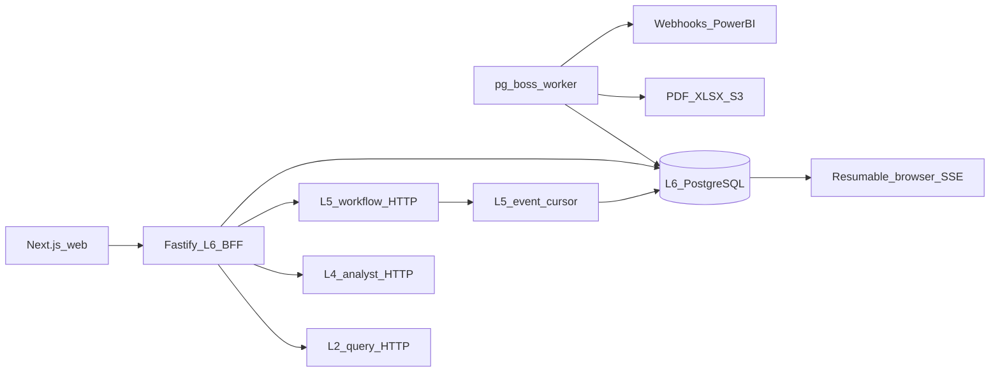

# Stamped L6 — Project Overview

## Purpose

Stamped L6 is the Experience & Integration layer for industrial energy operations.
It is the customer-facing control room where plant teams:

- clear EMS alarms;
- triage and close prescriptions with evidence;
- read potential, modeled, and ops-confirmed savings without confusing them with
  bill verification;
- investigate energy, equipment, demand, intensity, and emissions;
- use a contextual and full-workspace analyst;
- generate sustainability evidence; and
- connect external systems through files, APIs, webhooks, and Power BI.

The primary product action is: **clear the next high-value operational decision
with proof one tap away**.

## Users

| Role | Default surface | Core responsibility |
|------|-----------------|---------------------|
| Operator | Alarms | Acknowledge and act on assigned operational alarms |
| Supervisor | Prescriptions | Triage, assign, defer, reject, and close work |
| Plant head | Today | Review operational health and ops-confirmed value |
| Energy manager | Energy | Investigate trends, demand, equipment, and SEC |
| Sustainability | Reports | Produce defensible energy and emissions artifacts |
| CFO | Ledger | Read savings and evidence without operational controls |
| Admin | Settings | Manage users, plants, access, SSO, API, and webhooks |

## System overview

### Package boundaries

- `packages/web`: Next.js App Router product UI. It contains no service secrets
  and never accesses a database.
- `packages/api`: tenant-scoped BFF, local/Entra authentication, RBAC, upstream
  composition, public API, and SSE.
- `packages/contracts`: L6-owned schemas, upstream mappings, generated clients,
  and public API contracts.
- `packages/worker`: PostgreSQL-backed jobs for reports, webhooks, schedules, and
  Power BI.
- `external`: immutable platform authority mounted as a git submodule.

## Sources of truth

Precedence is:

1. Accepted ADRs under `external/decisions/`, especially ADR-020, ADR-022, and
   ADR-023.
2. `external/technical/layers/L6-experience-and-integration.md`.
3. L6 architecture, UI, and build handoffs under `external/handoff/`.
4. This repository's `DECISIONS.md` for implementation choices that do not
   redefine platform semantics.
5. Product code and generated transport snapshots.

Shared Stamped schemas remain in `external/contracts`. This repository must not
fork them.

## Core constraints

- Browser → L6 BFF → L2/L4/L5. No browser-held service credentials.
- L6 never reads an L2 database and never writes OT/SCADA systems.
- L5 owns alarm and prescription workflow truth.
- L4 owns RAG, tools, and analyst runtime.
- L2 owns telemetry, baseline, graph, and ledger persistence.
- Customer-facing P0 “verified” means `ops_confirmed` telemetry clearance.
  `verification_status=verified` is reserved for a future bill path.
- Analyst actions require explicit human confirmation.
- English is the only product language through P2.
- Redis, WhatsApp magic links, SAP/Tally writes, SCIM, native mobile, and full
  BRSR filing are outside this delivery.

## Product architecture

The web application uses a dynamic authenticated server shell with focused
client islands. TanStack Query owns live server state; URL parameters own
shareable filters; local component state owns transient interaction.

The BFF validates all input, resolves session → organization → plant →
permission, and then calls upstream services through bounded adapters. Reads
may retry within a small budget. Writes do not retry without an idempotency
key.

L6 owns PostgreSQL only for identity, membership, preferences, audit, report
metadata, integration configuration, durable event replay, and job state. It
does not replicate upstream domain truth.

Realtime delivery uses an append-only L6 event log plus PostgreSQL
`LISTEN/NOTIFY`. Notifications are wakeups; durable rows and cursors are truth.
Background work uses pg-boss on PostgreSQL. Redis is not required.

## Experience direction

The physical scene is a supervisor at a bright plant office desk at 10am,
moving between a phone and laptop to clear operational work before lunch.

The product uses Forge Industrial's light surface, dark structural chrome, and
restrained coral action color. Normal operation stays calm and grayscale;
color communicates abnormal state. Today contains no more than seven decision
signals. Cards only bound interactive units. Every primary route supports
loading, empty, error, stale, forbidden, and partial-data states.

Desktop and 360px mobile views are first-class. Keyboard use, 44px touch
targets, visible focus, WCAG AA contrast, reduced motion, and text/table chart
alternatives are release requirements.

## Performance constraints

At the 75th percentile, segmented by mobile and desktop:

- LCP ≤ 2.5 seconds;
- INP ≤ 200 milliseconds;
- CLS ≤ 0.1.

Primary-route JavaScript has a 350 kB gzip hard ceiling and a 250 kB target.
ECharts must not load on non-chart routes. A sampled 43,200-point chart targets
60fps interaction with a 30fps floor. Raw telemetry is range-capped.

## Delivery status

Phases **0–H** and **N** are complete in this repository (Forge product, BFF,
public `/v1`, worker, Playwright, CI, Mumbai CDK definitions). **Cutover** to
live Entra / Power BI / ECR remains blocked on human credentials and `cdk diff`
approval — see [`PROGRESS.md`](PROGRESS.md). UI demos use the Jaipur Works
fixture plant in `packages/web/src/fixtures/demo.ts`.
